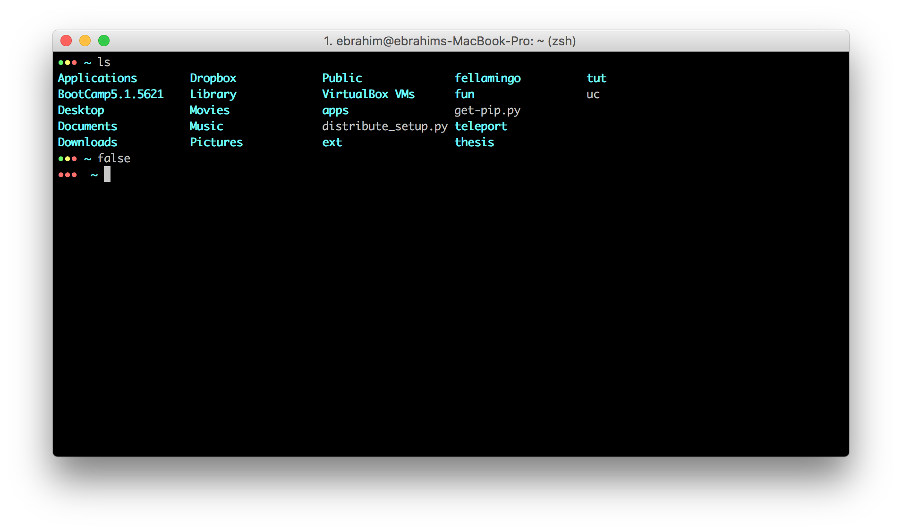
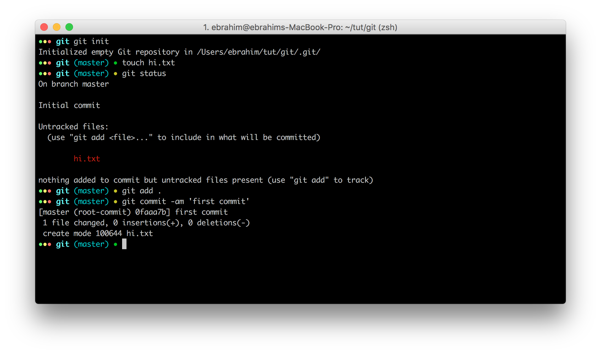

## Introduction

this is a minimal theme for zsh 

## Features
* Beautiful color
* Simple
* Git aware
  * green dot on clean 
  * yellow dot on dirty
  * show branch name

## Showcases





## Installation
[Install zsh](https://github.com/robbyrussell/oh-my-zsh/wiki/Installing-ZSH)

[Install oh-my-zsh](https://github.com/robbyrussell/oh-my-zsh#basic-installation)

Just copy the [`ebi.zsh-theme`](/ebi.zsh-theme) to your `~/.oh-my-zsh/custom/themes/` folder.
You can use this command :
```shell
curl https://raw.githubusercontent.com/poursadeqi/ebi-zsh-theme/master/ebi.zsh-theme > ~/.oh-my-zsh/themes/ebi.zsh-theme
```
or

You can use this set of commands: 

```shell
git clone https://github.com/poursadeqi/ebi-zsh-theme.git
cp ~/ebi-zsh-theme/ebi.zsh-theme ~/.oh-my-zsh/themes/ebi.zsh-theme
```

Then set `ZSH_THEME="ebi"` inside your `.zshrc`.

Here's the [official docs](https://github.com/robbyrussell/oh-my-zsh/wiki/Customization#overriding-and-adding-themes) on how to do that.


## License

[WTFPL](https://en.wikipedia.org/wiki/WTFPL): Do What the Fuck You Want To Public License